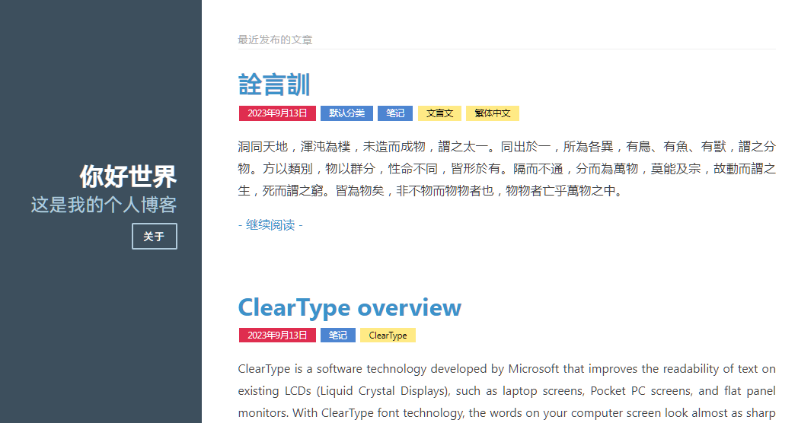
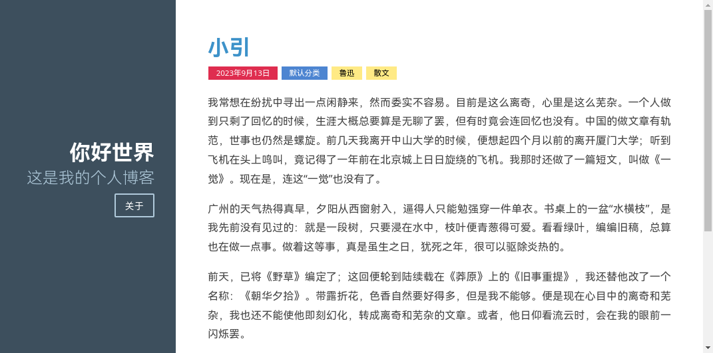
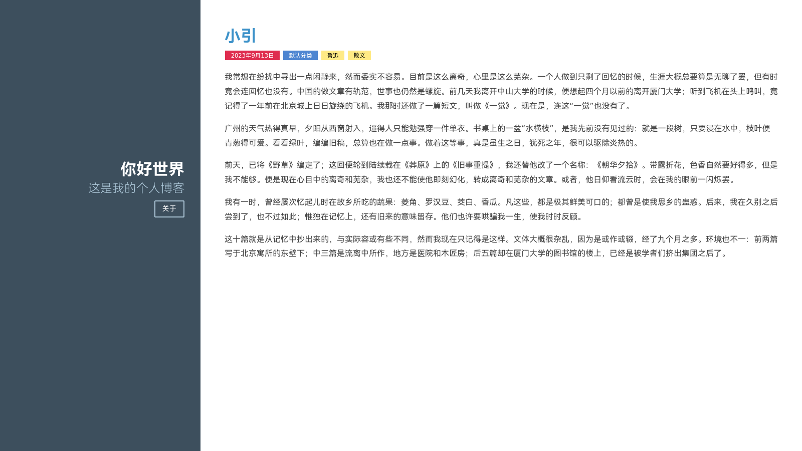
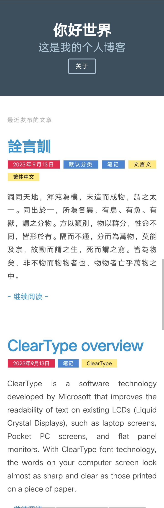

# Purity

一款使用了 [Pure CSS](https://purecss.io) 并参考了其[布局示例](https://purecss.io/layouts/blog/)而设计的 Typecho 主题。

## 说明

主题仍在完善中，只是先发布预览。

[点击](https://purity-preview.vercel.app)预览使用了该主题的静态网页。该网站为实际使用了该主题的 Typecho 程序生成的静态网页，与实际使用效果有出入，仅作静态预览主题之用，无动态功能。

## 预览

## 安装

下载所有源码解压后将目录复制到 Typecho 目录下的 `usr/themes` 然后在管理后台启用即可。

## 许可

[Pure CSS](https://purecss.io) 及其[布局设计](https://purecss.io/layouts/)，以及 [Typecho](https://github.com/typecho/typecho) 默认主题文件的许可信息，请参阅其各自的许可说明。

除此之外的部分使用 MIT 许可证进行许可。
